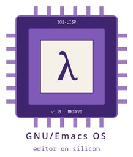

<p align="center">
  
</p>

# GNU/Emacs OS

An operating system where Emacs is the userland and Emacs is PID 1.

There is no shell other than eshell. There is no Shepherd. There is no
systemd. The first userspace process the kernel starts is a small C
program that becomes Emacs and then loads itself back as an Emacs
dynamic module, so the supervisor lives inside the supervised process.
Every system concept (`top`, `ip a`, `journalctl`, `df`, `apt`) is a
buffer with a major mode and a refresh timer.

This is v0.1. It runs. I use it.

## try it

```
cd iso-build
guix time-machine -C channels.scm -- \
    system image -L .. build.scm
./qemu-harness.sh /gnu/store/...-image.iso
```

You need a Linux host with KVM, Guix installed, and about 8 GB free
in `/gnu/store`. Boot takes around eleven seconds. Full instructions
in [INSTALL.md](INSTALL.md). The why is in [MANIFESTO.md](MANIFESTO.md),
and the manifesto is the document I would actually rather you read
first.

## what works

  - PID 1 is a C binary that execs Emacs and exposes the reaper, mount
    helper and signal handlers as Elisp functions via a dynamic module.
  - The panic buffer catches every uncaught error and refuses to let
    Emacs die.
  - `/bin/sh` is a 50-line C stub that forwards into eshell. No bash,
    no dash, no busybox.
  - EXWM brings up X11 as a window manager. X11 windows are buffers.
  - `*processes*`, `*network*`, `*journal*`, `*services*`, `*disks*`,
    `*packages*` are all live buffers with sensible keybindings.
  - The whole image builds reproducibly from a pinned Guix channel
    (commit `230aa373f315f247852ee07dff34146e9b480aec`).

## what does not work yet

The Hurd variant. Real hardware. Multi-user. Audio. Bluetooth.
Wayland. v0.2 will eat through that list. v0.1 is about proving the
core idea holds together under a normal day of work, which it does.

## the failure mode I have accepted

Emacs is single threaded. A stuck regex stalls the OS. A slow network
call stalls the OS. The panic buffer mitigates this for errors raised
through `condition-case`, but it does not save you from a tight loop
in C-level code. This is a documented design constraint, not a bug. I
lose maybe one session a week to it. If that ratio is unacceptable to
you, this is not your OS, and I will not be offended.

## the rules

  - Every file is in my voice. Lowercase commit messages, two-sentence
    paragraphs, no marketing prose.
  - No file in this repo references the tooling I used to write any
    part of it. I wrote it. That is the whole story. `/attribution-scan`
    enforces this before every commit and before every release.
  - Errors go through `panic-handle`, never bare `error`.
  - No `shell-command`, no `shell-command-to-string`, no
    `call-process` with a shell wrapper. `make-process` or get out.

The rest of the rules live in the project rules file at the repo root.

## status

  - v0.1: tagged, ISO is 1.57 GB, boots in QEMU.
  - v0.2: scoped, not started.

I am the only contributor. If you want to send a patch, read the
manifesto first so you know what you are signing up for.

## license

GPLv3 or later, same as Emacs and Guix. See `COPYING`.
